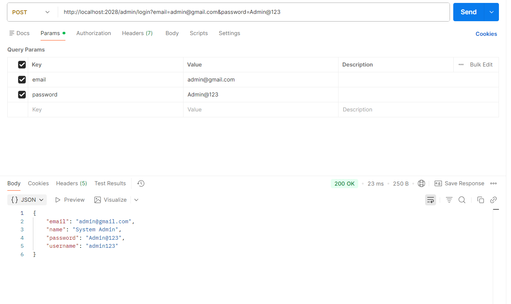
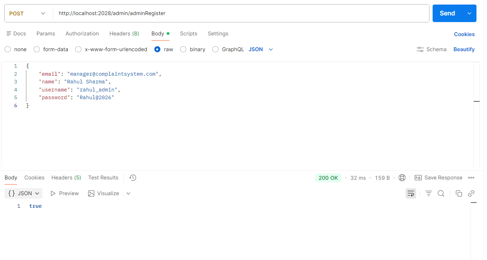
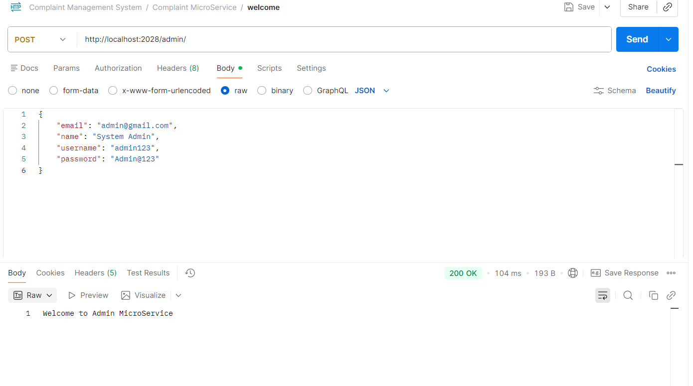

# Admin MicroService

The **Admin MicroService** is one of the backend services of the Complaint Management System. It is responsible for administrator registration and authentication.

## Current Scope

- Admin registration
- Duplicate email prevention
- Request and response DTOs
- DTO-to-entity and entity-to-DTO mapping
- Admin login
- Login using email or username
- MySQL persistence
- Basic service availability endpoint
- Postman API testing

## Technology Stack

### Backend
- Java
- Spring Boot
- Spring MVC
- Spring Data JPA
- Hibernate
- MySQL
- Lombok

### Development & Testing
- Maven
- Git
- GitHub
- Postman
- IntelliJ IDEA

## Configuration

Current development port:

```properties
spring.application.name=AdminMicroService
server.port=2028
```

Example database configuration:

```properties
spring.datasource.url=jdbc:mysql://localhost:3306/Complaintdb?createDatabaseIfNotExist=true&useSSL=false&allowPublicKeyRetrieval=true
spring.datasource.username=root
spring.datasource.password=your_password
spring.datasource.driver-class-name=com.mysql.cj.jdbc.Driver

spring.jpa.hibernate.ddl-auto=update
spring.jpa.show-sql=false
spring.jpa.properties.hibernate.format_sql=false
```

The current development setup uses a single MySQL database schema shared by the services.

> Do not commit real database credentials to GitHub.

## Admin Entity

```text
Admin
├── email
├── name
├── username
├── password
├── createdAt
└── isActive
```

The email is used as the primary key:

```java
@Id
private String email;
```

Therefore, every admin must have a unique email address.

## DTO Layer

The Admin MicroService now uses separate request and response DTOs for admin registration.

### AdminReqDto

`AdminReqDto` represents data received from the client:

```text
AdminReqDto
├── email
├── name
├── username
└── password
```

### AdminResDto

`AdminResDto` represents data returned to the client:

```text
AdminResDto
├── email
├── name
├── username
└── message
```

The password is not included in `AdminResDto`.

### Mapping

The service currently performs explicit mapping:

```text
AdminReqDto
      ↓
mapToEntity()
      ↓
Admin
      ↓
Database

Admin
      ↓
mapToDto()
      ↓
AdminResDto
      ↓
Client
```

This keeps the persistence entity separate from the API request/response models.

## API

### Admin Home

```text
GET /admin/
GET /admin/home
GET /admin/index
```

Example:

```text
http://localhost:2028/admin/
```

Response:

```text
Welcome to Admin MicroService
```

### Admin Registration

```text
POST /admin/adminRegister
```

Request type:

```text
application/json
```

Example:

```json
{
  "email": "manager@complaintsystem.com",
  "name": "Rahul Sharma",
  "username": "rahul_admin",
  "password": "Rahul@2026"
}
```

The service checks whether the email already exists before saving the admin.

If the email is new:

```text
true
```

If the email already exists:

```text
false
```

### Admin Login

```text
POST /admin/login
```

The current implementation accepts the login value through the `email` request parameter. It can contain either the admin's email or username.

Example:

```text
http://localhost:2028/admin/login?email=admin@gmail.com&password=Admin@123
```

Parameters:

| Key | Example |
|---|---|
| email | admin@gmail.com |
| password | Admin@123 |

The service first searches by email. If no admin is found, it searches by username. If the password matches, the `Admin` object is returned.

Example successful response:

```json
{
  "email": "admin@gmail.com",
  "name": "System Admin",
  "password": "Admin@123",
  "username": "admin123"
}
```

If the admin is not found or the password is incorrect, the current implementation returns `null`.

## Postman Testing

### Test 1 — Admin Home

**Method**

```text
POST
```

**Endpoint**

```text
http://localhost:2028/admin/
```

**Result**

```text
200 OK
```

Response:

```text
Welcome to Admin MicroService
```

The current controller uses `@RequestMapping` for the home endpoint, so the tested request uses POST.

### Test 2 — Admin Registration

**Method**

```text
POST
```

**Endpoint**

```text
http://localhost:2028/admin/adminRegister
```

**Body**

```text
raw → JSON
```

Test data:

```json
{
  "email": "manager@complaintsystem.com",
  "name": "Rahul Sharma",
  "username": "rahul_admin",
  "password": "Rahul@2026"
}
```

**Result**

```text
200 OK
true
```

This confirms that the admin registration method successfully saved the admin.

### Test 3 — Admin Login

**Method**

```text
POST
```

**Endpoint**

```text
http://localhost:2028/admin/login
```

**Query Parameters**

| Key | Value |
|---|---|
| email | admin@gmail.com |
| password | Admin@123 |

**Result**

```text
200 OK
```

The API successfully returned the registered admin object.

Example response:

```json
{
  "email": "admin@gmail.com",
  "name": "System Admin",
  "password": "Admin@123",
  "username": "admin123"
}
```

The login implementation also supports using the admin username in the `email` parameter.

## Postman Screenshots

The following screenshots document the successful Postman tests for the current Admin MicroService implementation.

### Admin Login

The login endpoint was tested with an admin email and password and returned `200 OK` with the registered admin object.



### Admin Registration

The admin registration endpoint was tested with JSON request data and returned `200 OK` with `true`, confirming successful registration.



### Admin Home

The service availability endpoint was tested successfully and returned:

```text
Welcome to Admin MicroService
```



## Request Flow

### Registration

```text
Postman / Frontend
        │
        │ POST /admin/adminRegister
        │ JSON
        ▼
AdminController
        │
        ▼
AdminReqDto
        │
        ▼
AdminService
        │
        ├── Check email
        ├── mapToEntity()
        ▼
Admin Entity
        │
        ▼
AdminRepository
        │
        ▼
MySQL
        │
        ▼
AdminResDto
        │
        ▼
Response
```

### Login

```text
Postman / Frontend
        │
        │ POST /admin/login
        ▼
AdminController
        │
        ▼
AdminService
        │
        ├── Find by email
        │
        ├── If not found → find by username
        │
        └── Verify password
                │
                ▼
              Admin
```

## Project Structure

```text
AdminMicroService/
├── src/
│   └── main/
│       ├── java/
│       │   └── com/
│       │       └── tausif/
│       │           └── AdminMicroService/
│       │               ├── controller/
│       │               ├── entity/
│       │               ├── repository/
│       │               └── service/
│       │
│       └── resources/
│           └── application.properties
│
├── pom.xml
├── mvnw
├── mvnw.cmd
└── README.md
```

## Current Architecture

```text
                    Complaint Management System
                              │
          ┌───────────────────┼───────────────────┐
          │                   │                   │
          ▼                   ▼                   ▼
   User MicroService   Complaint MicroService  Admin MicroService
          │                   │                   │
          └───────────────────┼───────────────────┘
                              ▼
                         MySQL Database
```

The current development setup uses a single MySQL database schema while the services remain separate Spring Boot applications.

## Development Status

### Admin MicroService V1

- [x] Create Admin MicroService
- [x] Configure Spring Boot
- [x] Configure MySQL
- [x] Create Admin entity
- [x] Use email as Admin primary key
- [x] Create repository
- [x] Create service layer
- [x] Create controller
- [x] Implement admin registration
- [x] Prevent duplicate admin emails
- [x] Implement admin login
- [x] Support login using email
- [x] Support login using username
- [x] Verify password
- [x] Introduce request DTO (`AdminReqDto`)
- [x] Introduce response DTO (`AdminResDto`)
- [x] Map request DTO to Admin entity
- [x] Map Admin entity to response DTO
- [x] Prevent password exposure in registration response
- [x] Test admin registration with Postman
- [x] Test admin login with Postman
- [x] Test service availability with Postman

## Planned Work

- [ ] Store logged-in admin in `HttpSession`
- [ ] Admin authentication/authorization
- [ ] Retrieve complaints through Complaint MicroService
- [ ] View individual complaint details
- [ ] View complaint evidence
- [ ] Admin dashboard
- [ ] Complaint management operations
- [ ] Request validation
- [ ] Global exception handling
- [ ] Password hashing
- [ ] Unit tests
- [ ] Integration tests
- [ ] API documentation
- [ ] Production configuration
- [ ] Service health checks

## Security Note

The current V1 implementation is intended for development and learning purposes.

Passwords are currently stored and compared directly. Password hashing and proper authentication/authorization should be implemented before using the service in production.

Sensitive values such as database passwords should not be committed to GitHub.

## Current Project Status

**Admin MicroService — V1 Basic Authentication Completed**

The Admin MicroService currently supports:

- Admin registration
- Duplicate email prevention
- Request and response DTOs
- DTO-to-entity and entity-to-DTO mapping
- Login using email
- Login using username
- Password verification
- MySQL persistence
- Basic service availability testing

The next focus is integrating the Admin MicroService with the Complaint MicroService so that authenticated administrators can access complaint information.

## License

This project is available for educational, academic, personal learning, and non-commercial research purposes.

Commercial use or sale of this project requires prior written permission from the author.

See the `LICENSE` file for the complete terms.
